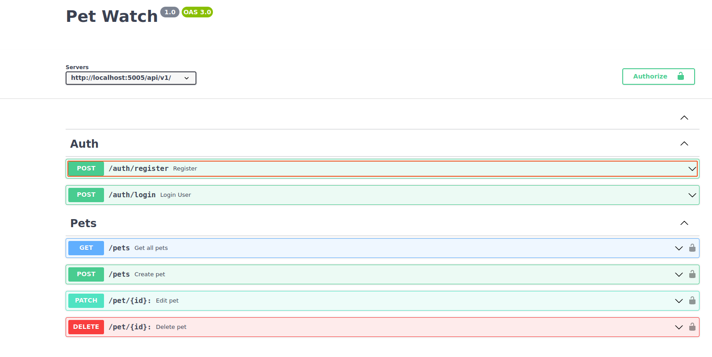

# Back-End Repo for Pet Watch
## Table of contents

* [Description](#description)
* [Demo](#demo)
* [Technology](#technology)
* [Routers](#routers)
* [Security](#security)
* [Setup](#setup)

## Description
Pet Watch is a React-Node application. It enables community members to report lost or found pets and to centralize pet information into one resource. Pet Watch provides an easy way to search the lost and found pet database and to communicate with the user who posted the pet.   

## Demo (screenshot) and API docs

- http://localhost:5005/api-docs/

## Technology Used
Pet Watch was created with:
- JavaScript
- Express
- Mongoose
- jsonwebtoken
- bcryptjs
- mocha/chai

## Routers
- auth.js
- pets.js

## Security

- helmet
- cors
- xss-clean
- express-rate-limit

## Setup Instructions

1. Create a folder to contain both the front-end and back-end repos 
2. Clone this repository to that folder
3. Run `npm install` to install dependencies
4. Pull the latest version of the `main` branch (when needed)
5. Run `npm run dev` to start the development server
6. Your back-end server is now running. You can now run the front-end app.

## Contributors

- Luis ([GitHub](https://github.com/Count-MonteCristo))
- Jennifer ([GitHub](https://github.com/JenMcD-star))
- Mariana ([GitHub](https://github.com/Maarimar))
- Mariela ([GitHub](https://github.com/Mariela-t))
- Tracy ([GitHub](https://github.com/trca831))

